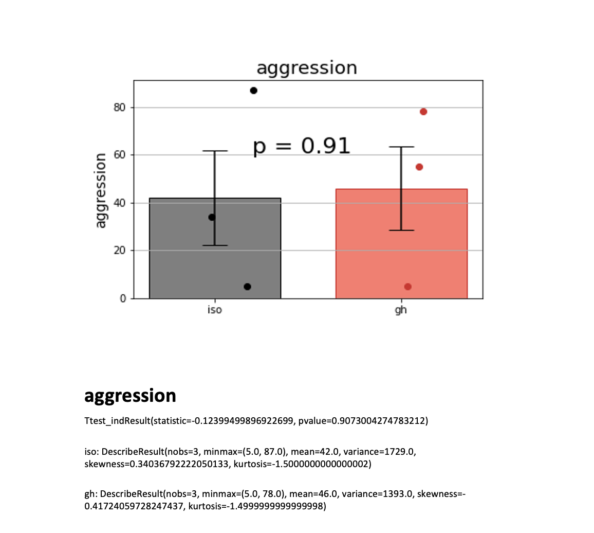
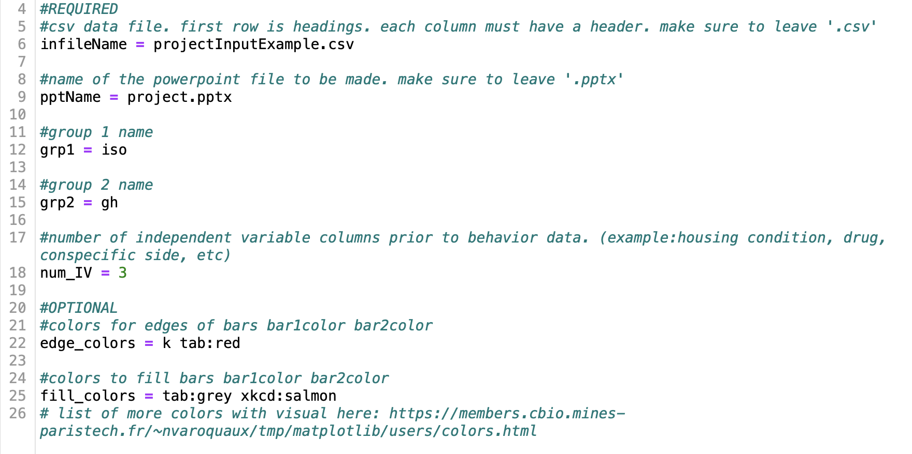
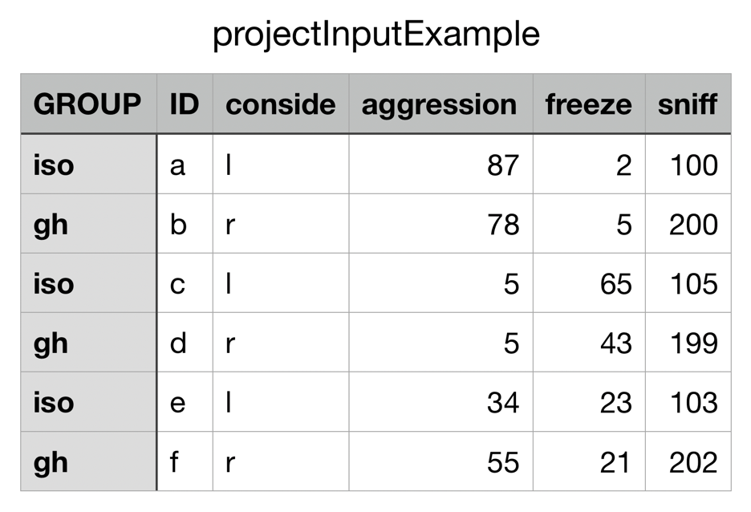

# Beh_Analysis: A Program for Analyzing and Visualizing Behavioral Data

## Jordan Grammer and Donzelle Taylor

### December 2022

### **Introduction**

Beh_Analysis is a Python program for calculating statistics and making
graphs of behavioral data (e.g., time spent engaging in aggression,
freezing, or prosocial behaviors). Beh_Analysis reads a CSV (comma
separated values) file and exports the statistics and graphs to a
PowerPoint file. Here is an example:

The program will output one PowerPoint file for each csv file. Each
slide in the PowerPoint file will contain a graph for one behavior, as
shown above, with descriptive statistics and the results of a t-test
displayed beneath the graph. The axis labels are the same as the column
header for each behavior. If the user wishes to change the axis label,
they should change the column header within their CSV file (i.e.,
aggression aggression time). If there is a statistically significant
difference between the two groups, the graph will display stars
according to the p-value.

|    P-value 	 | Stars 	 |
|-------------:|---------|
| p < 0.05   	 | *     	 |
| p < 0.01   	 | **    	 |
| p < 0.001  	 | ***   	 |
| p < 0.0001 	 | ****  	 |

If there is no statistically significant difference between the two
groups, the graphs will display the p-value.

### **Requirements**

To successfully run this program, users will need Python (version 3) and
the following packages: NumPy, Matplotlib, PPTX, and SciPy. The
[Anaconda Python distribution](https://www.anaconda.com/products/distribution) contains
Python, NumPy, Matplotlib, and SciPy.

### **Using the Program**

The program is executed from the command line using one argument: the
name of the parameters file. Within the parameters file, users can
specify experimental group names and details about their csv file (such
as the number of independent variables). To execute the Beh_Analysis
program, users should type the following into the command line:

    Beh_Analysis proj_param.py

### **Important Notes about the Program and Parameter File**

Users will need to provide the following information in the parameter file:

1.  infileName: name of the user's CSV file. Be sure to leave the ".csv"
    tag on the end of the file name.

2.  Grp1: name of one of the experimental groups, must match the group
    identifier in the CSV file

3.  Grp2: name of the other experimental group, must match the group
    identifier in the CSV file

4.  Num_IV: the number of columns in the csv file to the left of the
    behavior data to be analyzed. In the example CSV file below, num_IV
    should be set to 3 (Group, ID, and conSide = 3 columns to the left
    of the behavior data)

5.  pptName: name of the PowerPoint that will be generated. Be sure to
    leave the ".pptx" tag on the end of the file name.

*For all variables contained within the parameter file, users must only
edit the text \*after\* the name of the variable. Also, users must leave
a space between the equal sign and the name they choose for that
variable. See the example below.*

The following information is optional:

1.  Edge_colors: the color of the edge/outline of the bars on the bar
    graph. If the user does not specify a color, the program will
    default to black and salmon.

2.  Fill_colors: the color of the inside of the bars on the bar graph.
    If the user does not specify a color, the program will default to
    black and salmon.

The CSV file must be formatted according to the following guidelines to
successfully run the Beh_Analysis program:

1.  The first row of the CSV file must be the labels (i.e., Group, ID,
    etc.)

2.  The first label must be the group identifier

3.  Every column must contain a header

The image below shows a properly formatted CSV file:

